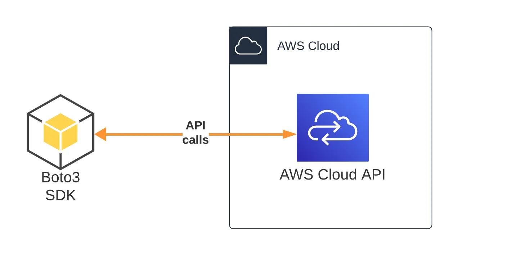
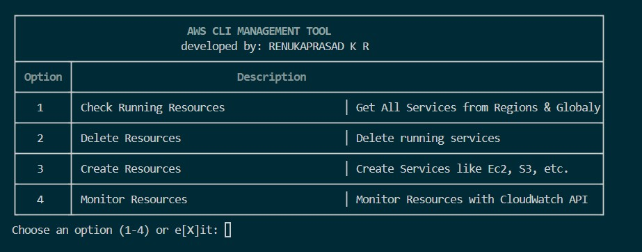

# AWS CLI Management Tool

**AWS CLI Management Tool** is a Python-based command-line application designed to simplify and automate AWS resource management. This tool provides a centralized solution for performing key operations such as fetching details, creating resources, deleting resources, and monitoring their status.

---



## **Features**

### 1. **Fetch AWS Resources**
- Retrieve details of various AWS resources globally or regionally.
- Display data in a structured table for easy readability.
- Supports fetching details for:
  - S3 Buckets
  - EC2 Instances
  - Lambda Functions
  - RDS Instances
  - EBS Volume 
  - DynamoDB 
  - BeanStalk
  - LoadBalancers
  - API Gateway 
  - ECS Cluster
  - EKS Cluster
  - EMR Cluster 
  - RedShift Cluster 
  - SES Identities 
  - IAM Roles 

### 2. **Delete AWS Resources**
- Allows deletion of specific AWS resources with interactive prompts.
- Handles edge cases such as versioning and non-empty S3 buckets.
- Ensures a safe deletion process with user confirmations for critical operations.
- Supports deleting:
  - S3 Buckets
  - EC2 Instances
  - Lambda Functions
  - RDS Instances
  - EBS Volume 
  - DynamoDB 
  - BeanStalk
  - LoadBalancers
  - API Gateway 
  - ECS Cluster
  - EKS Cluster
  - EMR Cluster 
  - RedShift Cluster 
  - SES Identities 

### 3. **Create AWS Resources**
- Provides an interactive flow to create new AWS resources.
- Supports detailed configurations, including runtime, roles, and environment variables for Lambda functions.
- Resources supported for creation:
  - EC2 Instances
  - S3 Buckets 
  - AWS Lambda Functions (with code deployment via ZIP file)

### 4. **Monitor AWS Resources**
- Track the state and health of key AWS resources.
- Provides a global view of resource statuses.
- Logs resource-related details for auditing and tracking.
- Currently it is working in progress
---

## **Prerequisites**
1. Python 3.8 or higher
2. pip3 installed
2. AWS CLI installed and configured with appropriate permissions with Credentials

###  **Configure AWS Cred.**
```
aws configure
```
**Example**
```
$ aws configure
AWS Access Key ID [None]: accesskey
AWS Secret Access Key [None]: secretkey
Default region name [None]: us-west-2
Default output format [None]:
```

---

## Installation 
1. **Clone the Repo**
```bash
git clone https://github.com/infosecsingh/AWS-CLI-Management-Tool.git
cd AWS-CLI-Management-Tool/
```
2. **Install dependencies**
```bash
pip install -r requirements.txt 
```

## **Usage**

### **1. Running the Tool**
Start the tool by running:
```bash
python main.py
```
-----


### **2. Available Options**
The tool provides a main menu with the following options:

1. **Fetch AWS Resources**  
   Fetch details about AWS resources and display them in a table.

2. **Delete AWS Resources**  
   Safely delete resources like S3 buckets and Lambda functions.

3. **Create AWS Resources**  
   Use interactive prompts to create AWS Lambda functions with custom configurations.

4. **Monitor AWS Resources**  
   View the current state and health of AWS resources.

5. **Exit**  
   Quit the tool.

---

## **Examples**

### Fetching S3 Buckets
```bash
Fetching S3 Buckets Globally....
+--------------+--------+---------------------+-------+
| ResourceType | Region |      BucketName     | State |
+--------------+--------+---------------------+-------+
|      S3      | Global | example-bucket-1    |  N/A  |
|      S3      | Global | example-bucket-2    |  N/A  |
+--------------+--------+---------------------+-------+
```

### Deleting a Bucket
```bash
Enter S3 bucket names to delete (comma-separated): example-bucket-1
Processing bucket: example-bucket-1...
Bucket 'example-bucket-1' deleted successfully.
```

### Creating a Lambda Function
```bash
Enter the name for the Lambda function: MyLambdaFunction
Enter the runtime for the Lambda function (e.g., 'python3.8'): python3.9
Enter the handler for the Lambda function (e.g., 'lambda_function.lambda_handler'): my_handler
Enter the IAM role ARN for the Lambda function: arn:aws:iam::123456789012:role/MyRole
Enter the path to the ZIP file containing the Lambda function code: ./function.zip
Environment variable key (or press Enter to finish): ENV_VAR_1
Enter value for ENV_VAR_1: value1
Environment variable key (or press Enter to finish):
Lambda function 'MyLambdaFunction' created successfully.
```

---

## **Logging and Data Saving**
- All details fetched or created can be optionally saved as JSON files for record-keeping.
- Logs important actions like deletions and creations for auditing purposes.

---

## **Known Limitations**
- Ensure appropriate AWS permissions are configured for the user or role running the tool.
- The tool is limited to resources supported by AWS SDK (`boto3`).

---

## **Contributions**
Contributions and feedback are welcome! Feel free to submit issues or pull requests.

---

## **License**
This project is licensed under the MIT License. See the LICENSE file for more details. 

--- 

## **Authors**
Developed by (RENUKAPRASAD).

## **Contributing**
Contributions of all types are more than welcome; if you are interested in contributing code, feel free to check out

Help us make AWS CLI Management Tool better. Welcome to provide design feedback, user experience discussions directly to us.
**Principal Maintainers: @renukaprasad
